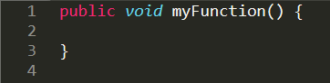
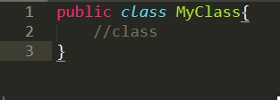
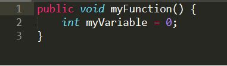
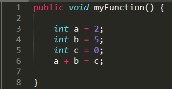

# DesignReport

## Introduction

For this late term assignment we are developing a simple TicTacToe game by using a technical infrastructure to support agile development. 
The first thing we did was setting up a class diagram of the classes and functions needed for the game to work. The classes needed were implemented  using test driven design. 

## Environment
Describe Environment used to develope.

## Description
Description here.

## Class Diagram
Class diagram here. 

## Programming Rules
Programming rules here.

1. For each feature we use a specific branch.

2. Curly brackets should always open in the same line as the declaration of a class, function or a loop.
	

3. All classes are named in PascalCasing
	

4. All functions and variables are named in camelCasing.
	

5. Space should always separate operators from variables.
	

6. Never push straight to the master branch.
