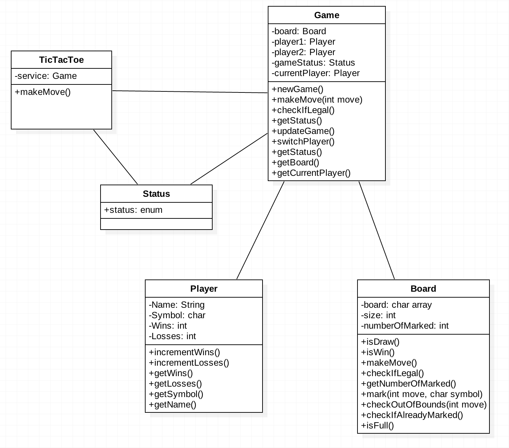

# DesignReport

## Introduction

For this late term assignment we are developing a simple TicTacToe game by using a technical infrastructure to support agile development. The  game will be coded in Java and completed using test driven development.

## Environment
The team will use Gradle to test, run and build the program. Code will be written in Sublime Text and for source control we will use GitHub. Heroku will be used to deploy the app to a web server. Travis CI will be used to build and test our project hosted at GitHub.

## Description
Tic-Tac-Toe is an old game in which two players alternately put X's and O's on a 3x3 grid. The game can be won by forming a row of three X's or three O's before the opponent does. If the board gets full with neither of the players getting a row of three then a draw is declared. 

## Class Diagram

The first thing we did before starting to code was setting up a class diagram of the classes and functions needed for the game to work.

## Programming Rules

1. For each feature we use a specific branch.

2. Curly brackets should always open in the same line as the declaration of a class, function or a loop.
	

3. All classes are named in PascalCasing.                                         
	

4. All functions and variables are named in camelCasing.                          
	

5. Space should always separate operators from variables.                          
	

6. Never push straight to the master branch.
